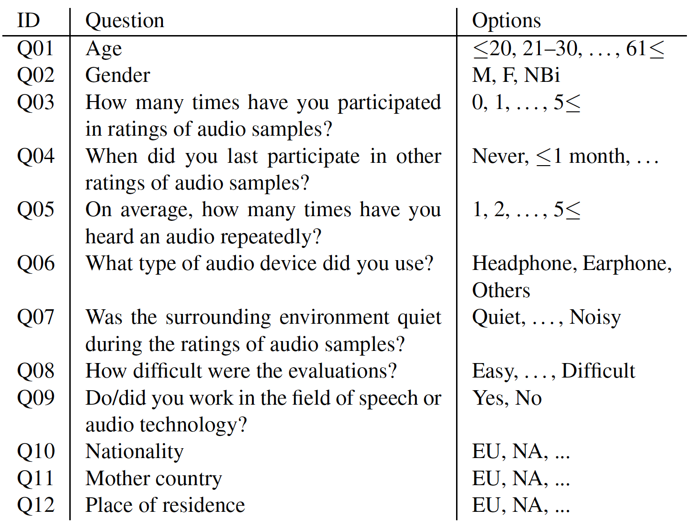
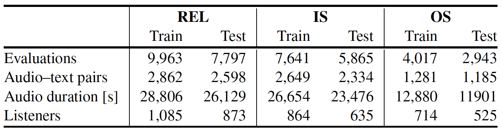

# RELATE dataset

## Contents

This dataset consists of the following contents:

- Audio–text pairs

	This dataset includes a number of audio-text pairs shown in the table below. The audios consist of both natural and synthetic types.
	Each text is written English.
	All audio sample was converted to mono 16-bit 16 kHz audio.

- 11-point scores between audio and text by each listener

	This dataset includes three types of subjective evaluation scores for semantic alignment between audio and text.
	- REL score: The overall relevance of the text and audio.
 	- Inclusion of sound event (IS) score: The extent to which the sound events described in the text are included in the audio.
  	- Order of sound event (OS) score: The degree of matching between the time series of sound events described in the text and the audio.

	The semantic-alignment score is on a scale of eleven from 0 (does not match at all.) to 10 (matched exactly).
	Each audio–text pair is evaluated by four listeners on average, who are native English speakers.

- Listener attributes
	we gathered age, gender, nationality, birthplace, residence, and experience of audio evaluation for listener attributes.
	The table below shows the questions and options.
	

## Statistics
This table shows the statistics of RELATE dataset.

## File format

- [REL, IS, OS].csv: There are 8 columns in the each csv file.
	- wavname: The file name of audio.
	- text: The text's corresponding audio.
	- score: The evaluation score.
	- listener_id: The listener ID who scored the sematic-alignment scores.
    - audio type: Shows whether the audio is natural or synthetic. If synthetic, contains the name of synthetic model.
    - anchor label: 
    - in RELATE dataset: Whether the pair belongs to the train set, validation set or test set in RELATE dataset.
    - in AudioCaps: Whether the pair belongs to the train set or test set in AudioCaps.

- [REL, IS_and_OS].csv: There are 13 columns in the each csv file.
	- listener_id: The file name of audio.
	- question[1, 2, ..., 12]: The answer of the question in questionnaire. The answes are quantified, with options assigned a numerical value starting from 1 for the leftmost choice and increasing sequentially.

## Directory structure

The directory structure of this dataset is as follows:

	XACLE_dataset
	├── listeners
	│   ├── REL.csv
	│   ├── IS.csv 
	│   └── OS.csv
	└── scores
		├── REL.csv
		├── IS.csv 
		└── OS.csv

## Citation

Please cite the paper that will be uploaded to arXiv in early November, 2025.
RELATE???

## Acknowledgment

The work was supported by JSPS KAKENHI Grant Number 23K24895, 24K23880, 25K21221, JST Moonshot Grant Number JPMJMS2237.
